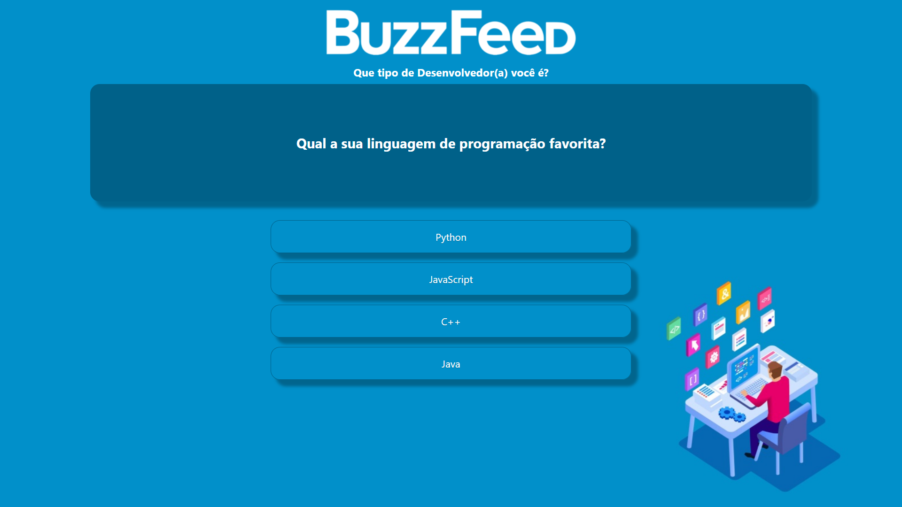

# My_Quiz_Angular

O projeto *_My_Quiz_Angular_*, é uma aplicação Web construida com o Framework Angular, baseado em um site de Quizzes, o *_BuzzFeed_*. O aplicativo consiste em um Quiz de 5 perguntas que dão 4 alternativas para o usuário escolher, aonde cada escolha realizada, influência o resultado final do teste. O principal objetivo, é testar os conhecimentos adquiridos durante as aulas do _bootcamp Code The Future Banco Pan_ na plataforma _Dio_ pelo professor _Felipe Aguiar_ na criação de aplicaçôes web dinâmicas e interativas.

## 🔨 Funcionalidades do projeto

A página do `My Quiz` conta com uma `interface de usuário interativa` por meio de divs que se comportam como botões clicáveis onde o usuário consegue estar interagindo com o quiz. O quiz conta com `multiplos resultados de teste`. A cada escolha, as respostas são armazenadas e processadas, dependendo da escolha do usuário pode se obter resultados diferentes.

## Conceitos Importantes

- `Data Binding`
- `Two Way Data Binding`
- `Life Cycle Hooks`
- `Router`
- `Módulos Angular`

### Tecnologias

